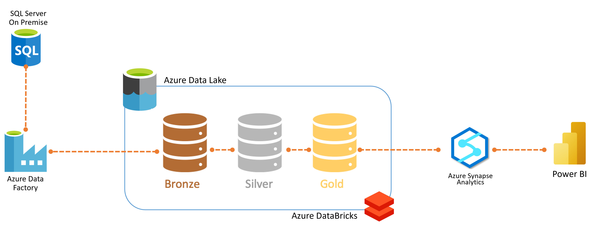
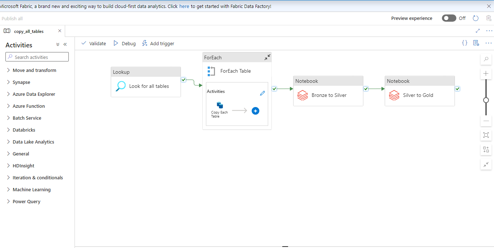
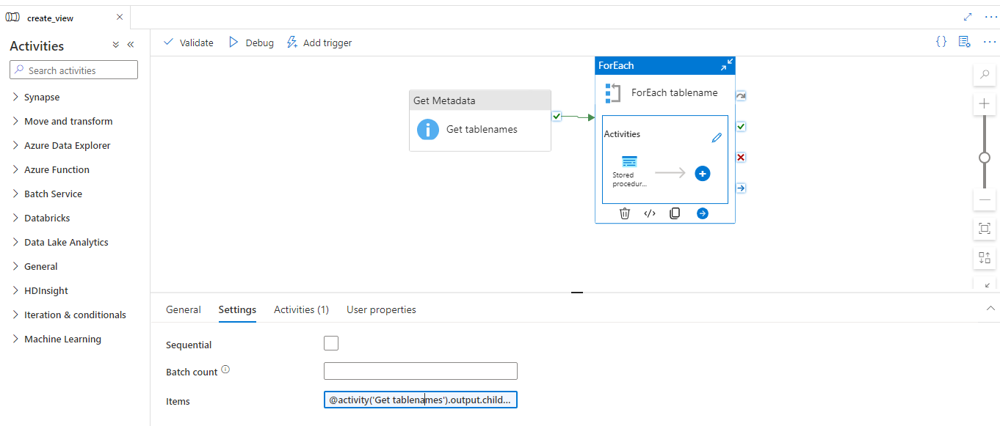
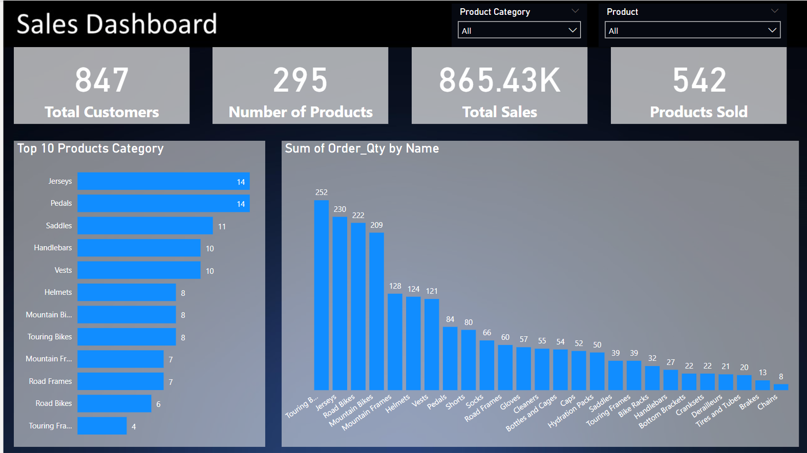

# Azure End to End Pipeline
The use case for this project is building an end to end solution by ingesting the tables from on-premise SQL Server database using Azure Data Factory and then store the data in Azure Data Lake. Then Azure databricks is used to transform the RAW data to the most cleanest form of data and then we are using Azure Synapse Analytics to load the clean data and finally using Microsoft Power BI to integrate with Azure synapse analytics to build an interactive dashboard. Also, we are using Azure Active Directory (AAD) and Azure Key Vault for the monitoring and governance purpose. 

The tools that are covered in this project are,

1. Azure Data Factory
2. Azure Data Lake Storage Gen2
3. Azure Databricks
4. Azure Synapse Analytics
5. Azure Key vault
6. Azure Active Directory (AAD) and
7. Microsoft Power BI

Use ADF for Data Ingestion from SQL on Premise to Azure Data Lake.

Use Databricks to Transform data from Bronze Layer to Gold layer with Python Notebook. 
https://github.com/alutfiadi/azure-pipeline/tree/bcf8824aac07046543bc61f1ce68a9c23aa7b5fc/Databricks 

use Azure Synapse Analytics to Load data from Gold layer to Power BI.

and last step is to create simple Dashboard in Power BI.

